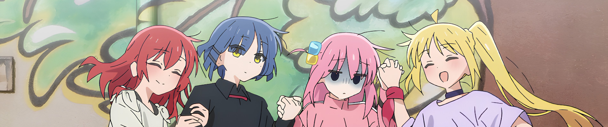
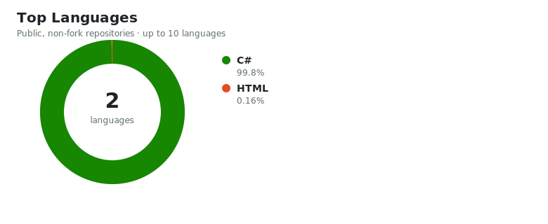

<h3 align="center">🚧 This profile is still under construction, and some information is incomplete.</h3>

  

  BOCCHI THE ROCK! © Aki Hamaji / Houbunsha, Aniplex · Image source: <a href="https://anilist.co/anime/130003">AniList</a>

  <a href="./README.md">简体中文</a> ·
  <a href="./README_EN.md"><strong>English</strong></a> ·
  <a href="./README_JA.md">日本語</a>

<h1 align="center">Hi, I'm awaqwq233 👋</h1>

  Software Engineering undergraduate at Wuhan University · Class of 2028

  
  
  

  
  

---

## About Me

- 🎓 **Current focus:** I'm **awaqwq233** on most platforms, meow. No idea. Backend for now; I can't do algorithms, but apparently I have to become full-stack, meow.
- 🔭 **Working on:** An unpaid internship at a securities company—learning Oracle optimization from scratch, currently in full swing.
- 🌱 **Next goals:** Can I find a girlfriend? Learn some useful skills? Stay disciplined enough to pass N2 next year? Make everyone happy, meow?
- 💡 **Interested in:** Mysterious indie games, multiplayer games, and going a little feral.
- 🎯 **Long-term goal:** Make every good person happy, meow.
- ⚡ **Beyond code:** Eating, drinking, and answering nature's calls.

## Tech Stack

### Proficient

`None`

### Some Experience

  

`C++` · `Java` · `C#`

### Familiar With

  
  

`Qt` · `Linux` · `MySQL` · `PostgreSQL` · `MongoDB` · `Redis` · `SQLite` · `Oracle`

### Want to Explore

  

`AWS` · `Azure` · `Bash` · `CSS` · `Docker` · `Git` · `HTML` · `JavaScript` · `Jenkins` · `Node.js` · `Photoshop` · `Python` · `React` · `Spring` · `Vue`

## Coding Profile

  

## Projects

<!-- Replace the links, names, descriptions, and stacks below with your real projects. Keep 2–4 representative projects. -->

| Project | Description | Stack |
| :--- | :--- | :--- |
| [Project A](https://github.com/xiaoben520) | `[Explain the problem this project solves in one sentence]` | `[Tech 1]` · `[Tech 2]` |
| [Project B](https://github.com/xiaoben520) | `[Describe your contribution or the main highlight]` | `[Tech 1]` · `[Tech 2]` |
| [Project C](https://github.com/xiaoben520) | `[Summarize the outcome in one sentence]` | `[Tech 1]` · `[Tech 2]` |

## Blog

<!-- If you do not have a blog yet, remove this section and restore it later. -->

- [Article Title A](https://example.com) — `[One-sentence summary or topic]`
- [Article Title B](https://example.com) — `[One-sentence summary or topic]`
- [Article Title C](https://example.com) — `[One-sentence summary or topic]`

---

  Thanks for stopping by. I hope you write something you're proud of today.

